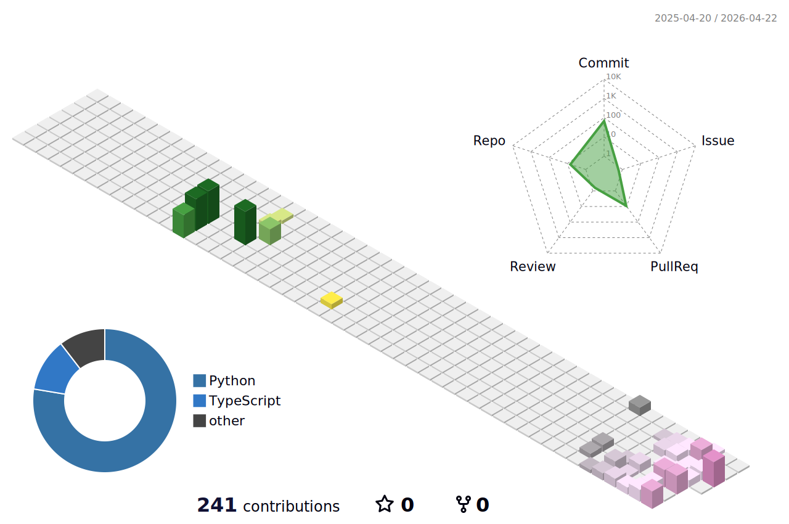

# Hi there, I'm Chidroopa Kanaparthy! 

  

---

### About Me

I am deeply interested in Machine Learning, Data Science, and AI. I love diving into complex data sets, building predictive models, and contributing to tools that other developers use.

* **Fun fact:** When I'm not tweaking hyperparameters, you can probably find me out shooting and editing photos in Lightroom for my next photography inspiration.

---

### 🛠️ My Tech Stack

  

    

  
  
  
  
  
  
  
  
  
  
  

---

### 🏙️ Contribution City

  

---

### 📫 Connect with Me

  
  
  

