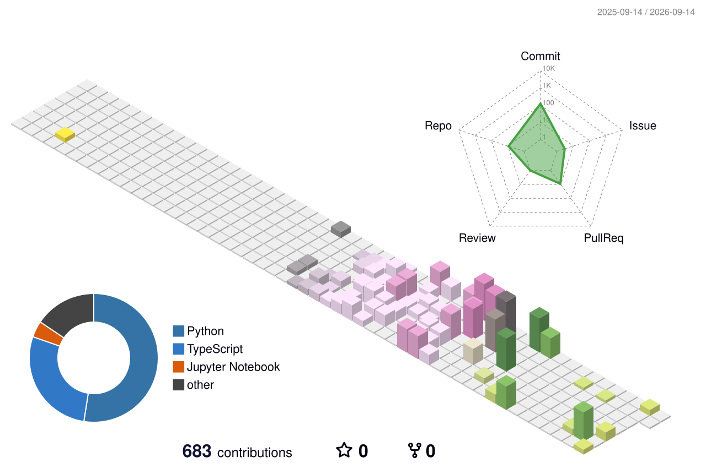

# **Hi there, I'm Chidroopa Kanaparthy**

  

---

## About Me

I'm a Computer Science undergrad working on the intersection of vision-language models, fairness, and adversarial robustness. I'm currently interning at DRDO's Scientific Analysis Group, where my work spans adversarial attacks on face verification pipelines and — more centrally right now — auditing whether open-weight VLMs produce demographically disparate hallucinations when explaining face verification decisions.

I care about the gap between what models do and what they say they're doing — and I think that gap is where a lot of real-world AI harm hides. That's the thread connecting my current research: not "is the model accurate," but "is the model's explanation of itself honest, calibrated, and fair across groups."

Longer-term, I'm building toward research or engineering work in AI safety and mechanistic interpretability.

---

## Current Research

VLM Hallucination Fairness Audit (NeurIPS 2026 Workshop, in progress)
An explainability-layer fairness audit — asking whether VLMs (Qwen2.5-VL-7B-Instruct, InternVL3-8B) hallucinate differently across demographic groups when explaining decisions from separate face-verification models (ArcFace, AdaFace R50). Metrics: Hallucination Rate (primary), Calibration Disparity, Refusal/Hedging Rate, validated via Cohen's kappa across annotators. Built on RFW and DemogPairs, with resolution confounds controlled via regression covariates.

Adversarial Transfer Attacks on Face Verification (DRDO SAG)
Implemented and benchmarked PGN (Ge et al., NeurIPS 2023) and DHF (BMVC 2023) transfer attacks across face verification pipelines — finished 2nd of 8 on the internal leaderboard, with a notable impersonation/dodging performance split as a headline finding.

---

## Tech Stack

Focus areas: VLM evaluation & explainability · adversarial robustness · fairness auditing · multi-agent systems · classical ML (RF, XGBoost, SHAP)

---

## Selected Projects

- VLM Fairness Audit — hallucination disparity across VLM explanations of FV decisions (RFW, DemogPairs) — in progress, NeurIPS 2026 workshop target
- Adversarial Robustness on Face Verification — PGN/DHF transfer attacks, ArcFace/AdaFace, IR152 — 2nd/8, DRDO internal leaderboard
- Anomalous Kinematic Detection & Safety Pipeline — Random Forest on IMU telemetry
- Lead-Flow AI — multi-agent lead qualification system (LangGraph, Gemini)
- Customer Churn Prediction — XGBoost + SHAP for interpretable churn modeling
- Open-source contributions: SymPy, KubeEdge Ianvs

---

Contribution City

  

---

## Connect with Me

  
  
  

